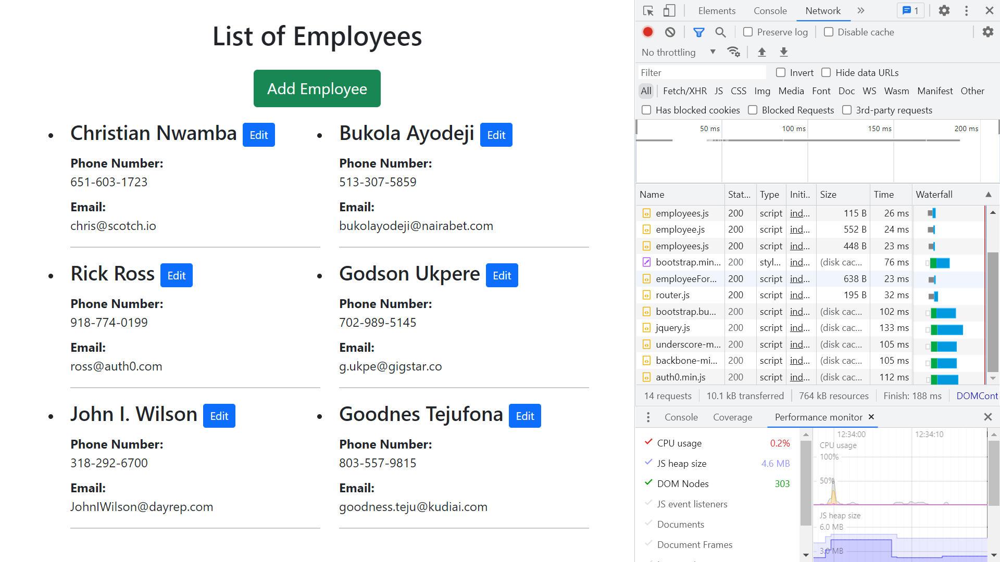
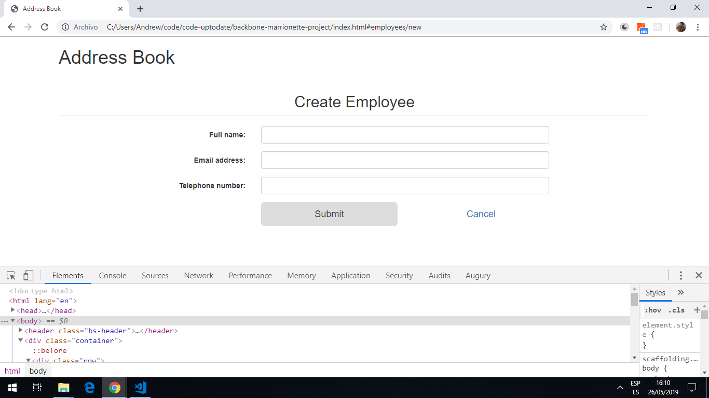

# :zap: Backbone Employee Project

* Tutorial project using the [Backbone.js library](https://backbonejs.org/#) together with [jQuery](https://code.jquery.com/).
* **Note:** to open web links in a new window use: _ctrl+click on link_


## :page_facing_up: Table of contents

* [:zap: Backbone Employee Project](#zap-backbone-employee-project)
	* [:page_facing_up: Table of contents](#page_facing_up-table-of-contents)
	* [:books: General info](#books-general-info)
	* [:camera: Screenshots](#camera-screenshots)
	* [:signal_strength: Technologies](#signal_strength-technologies)
	* [:floppy_disk: Setup](#floppy_disk-setup)
	* [:computer: Code Examples](#computer-code-examples)
	* [:cool: Features](#cool-features)
	* [:clipboard: Status & To-Do List](#clipboard-status--to-do-list)
	* [:clap: Inspiration](#clap-inspiration)
	* [:file_folder: License](#file_folder-license)
	* [:envelope: Contact](#envelope-contact)

## :books: General info

* Backbone.js gives structure to web applications by providing models with key-value binding and custom events, collections with a rich API of enumerable functions, views with declarative event handling, and connects it all to your existing API over a RESTful JSON interface.
* BackboneJS architecture contains the following modules −

1. HTTP Request
2. Router
3. View
4. Events
5. Model
6. Collection
7. Data Source

* Some apps are too small to need building with an SPA framework such as Angular. The simplicity and interactivity of a jQuery-based application can be combined with the well-structured building blocks from Backbone.js to create interactive pages with code organization and structure.

## :camera: Screenshots




## :signal_strength: Technologies

* [Backbone.js library v1 from CDN](https://backbonejs.org/#)
* [Bootstrap v5 from CDN](https://getbootstrap.com/)
* [jQuery v3 from CDN](https://code.jquery.com/)

## :floppy_disk: Setup

* runs from `index.html` in browser.

## :computer: Code Examples

```javascript
EmployeeManager.Views.Employee = Backbone.View.extend(
	{
		tagName: 'li',
		className: 'media col-md-6 col-lg-4',
		template: _.template($('#tpl-contact').html()),

		events: {
			'click .delete-employee': 'onClickDelete'
		},

		initialize: function() {
			this.listenTo(this.model, 'remove', this.remove);
		},

		render: function() {
			var html = this.template(this.model.toJSON());
			this.$el.append(html);
			return this;
		},

		onClickDelete: function(e) {
			e.preventDefault();
			this.model.collection.remove(this.model);
		}
	}
);

```

## :cool: Features

* employees can be added and edited

## :clipboard: Status & To-Do List

* Status: Working. Delete function not working
* To-Do: Fix delete function. Delete button commented out

## :clap: Inspiration

* [BackboneJS - Quick Guide](https://www.tutorialspoint.com/backbonejs/backbonejs_quick_guide.htm)
* [Auth0: BackboneJS: Getting Started](https://auth0.com/blog/backbonejs-getting-started/#Understanding-Key-Concepts-in-BackboneJS)

## :file_folder: License

* This project is licensed under the terms of the MIT license.

## :envelope: Contact

* Repo created by [ABateman](https://github.com/AndrewJBateman), email: gomezbateman@yahoo.com
